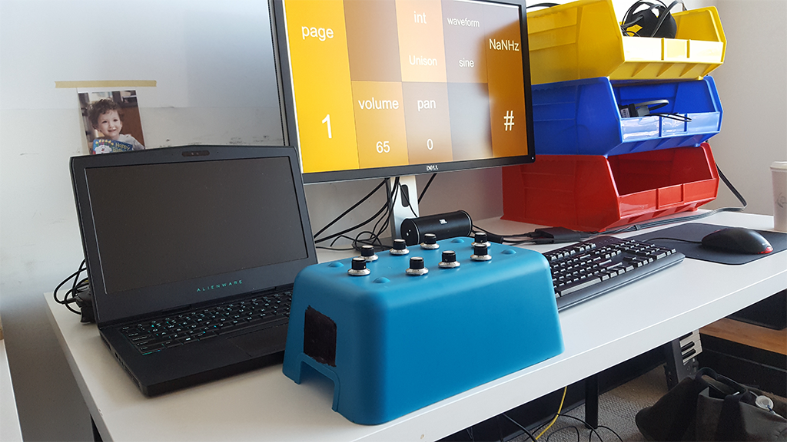
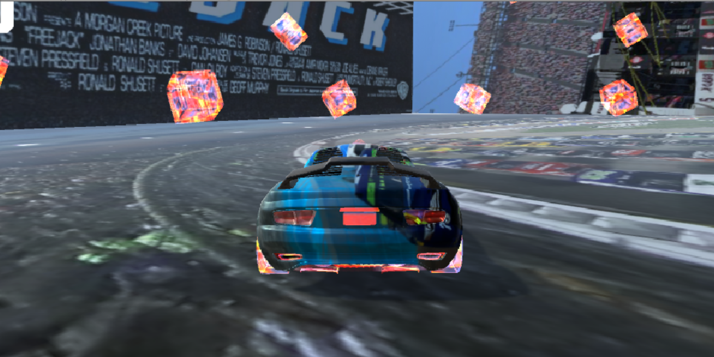
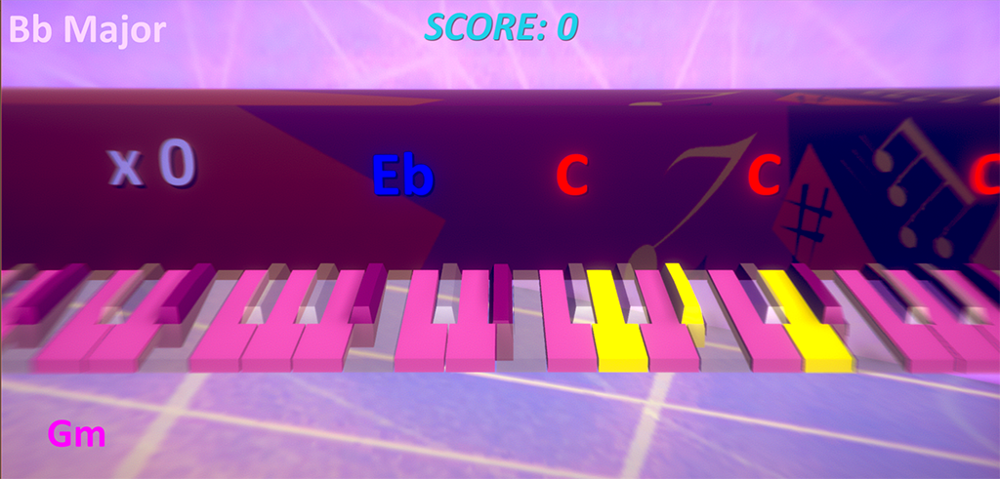
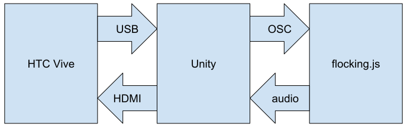

# DIGF5006 - New Interfaces for Musical Expression - OCAD University
## Blog
### Post 1 - May 18, 2018
#### Performer Audience Contract
A most interesting tangent emerged during our first 'sounding' session as part of Adam Tindale's new course New Interfaces for Musical Expression at OCAD University. If that's familiar tituallary, it's an homage to the course's inspiration, NIME – The International Conference on New Interfaces for Musical Expression. It's the first iteration of the course, but Adam's connection to the conference and his depth of experience forecasts an exciting, engaging, and experimental six weeks.

Back to the tangent, in our first experimental listening and performance 'sounding' session, we embarked on a lively debate on the definition of a performance in a musical context. More specifically, we explored the figurative contract a performer has with their audience.

Are there requirements of a performer that qualify them as a performer and the event a performance? If so, what are they?

Does a musician need to perform using their voice or other musical instrument in a performance? If yes, further gradations arise in the variances and possibilities of musical instruments themselves. Electronic instruments are ubiquitous in contemporary performance, but there's a wide range of interactions and engagement with the the apparatus that divides opinion on the validity of the resulting performance. Adam had a great example of the Orb, pushing play at the top of their set and then engaging in a game of chess for the duration of the musical experience. The interesting thing about this example is that no effort was spent trying to deceive the audience as to their on-stage activities or their real-time influence over the music playback. There's an honesty to this that I appreciate and perhaps this is the core of the contract; connect with your audience without embellishing the fundamental nature of your performance. If you’re singing, sing. If you’re turning a knob and grimacing, that knob should be doing something. This is not to say there should be no embellishment as that would make for mundane experiences. However, to suggest a sonic contribution where there is none only serves to create friction between the audience and performer if the deception is revealed.

There are examples where this friction is embraced and exploited as an element of the performance. The KLF was one such act that had a complex and sometimes antagonistic relationship with their audience. One of my favourite clips is their performance as the Timelords on Tops of the Pops, performing their early hit ‘Doctorin’ the Tardis’. The robust performance and mimicry create strong moments of synchresis but it’s obvious to any fan of popular music that the only music other than vocals are samples of the Doctor Who theme and Gary Glitter’s Rock and Roll Part 2. The deceit is playfully revealed when the drummers cease drumming for dramatic effect, but the recorded drum track keeps chugging along.

<iframe width="560" height="315" src="https://www.youtube.com/embed/zKQhB9Z5Jxg?start=49" frameborder="0" allow="autoplay; encrypted-media" allowfullscreen></iframe>

### Post 2 - May 31, 2018

#### Code as performance

As part of the NIME course, each student is reading and presenting on papers from the NIME archive. Each week, we each examine both a self-selected and randomly chosen paper from a range of years. This past week looked at  2001 through 2005, the founding years of the conference. It was daunting to source a single entry from the wealth of papers available. Most of the topics warranted further investigation of the abstract. I skimmed through half a dozen papers before finally settling on Ge Wang and Perry Cook’s *On-the-fly programming: using code as an expressive musical instrument*.

What interested me in this paper was the idea of live-programming as a musical performance. I had heard about live coding jams where a coder would start a new program from scratch in a performance setting, but I had never considered a musical performance created by code in realtime. Perhaps this is the beauty of continuing education: small but important revelations on what’s possible in different contexts. As an electronic performer myself, I’m well versed in the use of electronic and digital instruments in performance but live code had eluded my gaze. Using digital instruments, one is working with code, but at a higher-order surface-level connection with pre-coded control over specific parameters.

As the paper spells out, a live coding performance uses text editor and a live compiler. It’s the latter that really makes this possible, with the authors creating Chuck, a bespoke compiler for live musical coding. The main challenges of their work was creating a modular system that allowed for elements to be added and removed from a live running program. Secondly, this timing of this system must be robust enough to support a musical framework and not lose the beat or hiccup while modifying the existing program. The following is a key passage that illustrates the moment of submitting new code to the compiler for live inclusion into the running program. This is the magic of Chuck

> Add – type-checks and compiles a new shred (from a ChucK source file, a string containing ChucK code, or a pre-compiled shred). If there are no compilation errors, the shred is allocated and sporked in the virtual machine with an unique ID. A new virtual stack is allocated, and the shred is shreduled immediately to execute from the beginning. When add fails due to compilation errors, the virtual machine continues to run as before while the

I really appreciate the colourful language such as *sporked* and *shreduled* that characterizes the Chuck programming language.

The first video illustrates a Chuck performance from the computer performance. The latter illustrates a Chuck performance from the audience perspective.

<iframe width="560" height="315" src="https://www.youtube.com/embed/D_JSDNoc4Gs" frameborder="0" allow="autoplay; encrypted-media" allowfullscreen></iframe>

<iframe width="560" height="315" src="https://www.youtube.com/embed/ZXuZpAYqmco" frameborder="0" allow="autoplay; encrypted-media" allowfullscreen></iframe>

#### scoreTable

My randomly selected paper, *Mary had a little scoretable* or the reactable* goes melodic* complemented Ge Wang’s paper nicely. This paper by Sergi Jordà and Marcos Alonso introduces a sidecar composition and arrangement interface for their previous work, the reacTable. Backing up for a second, the reacTable is a mindblowing tabletop interface that optically tracks objects (fiducials) on a table and uses their presence and orientation on the table as inputs into the reacTable musical interface. Furthermore, a GUI is projected onto the surface of the table, providing visual feedback of the interaction.

<iframe width="560" height="315" src="https://www.youtube.com/embed/Mgy1S8qymx0" frameborder="0" allow="autoplay; encrypted-media" allowfullscreen></iframe>

The interesting takeaway from this article is the comparison of the reacTable to traditional musical instruments. While the reacTable is a fantastic platform to explore timbre, arrangement, and other musical parameters, its ability to ‘musically’ pitch its performance is limited. Referencing Perry Cook’s comments at the inaugural NIME that a instrument should be able to perform *Mary Had a Little Lamb*, the team created the scoreTable, in part, to satisfy that challenge. It raises an interesting debate on the validity of a musical instrument, primarily on the basis of pitch. As the reacTable team argued, their device could do so much more than other instruments and pitch was not of primary concern.

I would argue that pitch is only one parameter of many that define a musical instrument and that any instrument can be placed on a spectrum between pure tones and broadband noise. In our lively in-class debate we explored instruments that are as close to pure tones or sine waves as possible, shakuhachi flutes as an example. I received some flak from our percussionist-heavy group by suggesting that drums exist on the other end of the spectrum. I was treated to a drums only version of *When the Saints Go Marching In* as a rebuttal. I think my argument was taken as anti-drum, whereas my intention was to be inclusive of all instruments on the pitch-ability spectrum as musical instruments.

I for one am fascinated by one-note songs where standard melodic instruments do not deviate from a single pitch. While not-suitable-for-work (if you speak French), the following is one of the best examples.

<iframe width="560" height="315" src="https://www.youtube.com/embed/NgSWm9_BZjs" frameborder="0" allow="autoplay; encrypted-media" allowfullscreen></iframe>

### Post 3 - June 22, 2018

Fascinating conversations and in-class explorations are only one component of OCAD's DIGF5006, *New Interfaces for Musical Expression*. As our major project we're developing our own musical interfaces while authoring a supporting paper in the NIME format. In my short time in the *Digital Futures* masters program at OCAD, I've already explored the creation of three musical interfaces and I'm eager to continue this exploration. Here's a quick summary of my musical work to date in my master's studies.

#### Previous Work
##### Harmonizer

The development of the Harmonizer was inspired by a fascination with the differences between *just* and *equal* intonation of musical instruments. The Harmonizer is an audible frequency interval reference that can switch between just and equal intonation. Essentially, one can build chords and then compare the difference between tuning systems. Coded in JavaScript, the Harmonizer featured a physical interface of eight potentiometers connected to the browser via a microcontroller attached via a serial connection. The current iteration uses P5.js' sound add-on library. My next iteration will feature a web interface and will be rebuilt using flocking.js.

http://blog.ocad.ca/wordpress/digf6037-fw201702-01/2017/11/harmonizer/

##### Danger zone

This was a fun and flippant game I created in Unity. You are driving a car on the inside of a cube. Six buttons determines the vector of gravity, determining the surface that you drive one. In addition, each side of the cube portrays time differently with the music playing back at a different rate or direction depending on the side of the cube.

https://braithwaite-finlay.format.com/blog/digital-games-blog-003-danger-zone

##### Junior Jazz Hands

I lost myself in developing this music improvisational gaming tool. Through engaging a musical framework in play, players learn to play in key, form chords, and improvise. Future iterations will feature two-player modes where game theory models of Nash equilibrium will reward players for improvising successfully with one another.

https://webspace.ocad.ca/~3164558/JJH/

#### Introducing V-aural

https://github.com/braithw8/V-auRal

Taking this work of developing musical interfaces further while exploring technologies currently unfamiliar to me, I resolved to create V-Aural, a virtual reality navigational synth. In short, through navigating space in virtual reality you are controlling the parameters of a synth.

Various parameters of navigation are mapped to parameters of the synthesizer engine. For example, the player's current position XYZ position in 3d space is mapped to the pitch of three oscillators. The player's velocity is mapped to the intensity of frequency modulation and rotation is mapped to amplitude modulation.

Through this exploration I am connecting the work I did in JavaScript and Unity. Unity is the front-end of the system, connecting with the VR input; in my case an HTC Vive. The backend is handled by my first implementation of flocking.js through node.js. Also new to me is OSC which forms the conduit between Unity and node.js.

Developing in VR is a pain in the neck, with constantly the constant donning and removal of the headset, so I've begun my work with a screen and an XBOX one controller as my input. So far, I've successfully connected my 3d object in Unity to flocking.js. There's still work to do in refining the 3d object itself as well as its mapping to flocking. For now though, there's a solid framework to continue developing.

The largest remaining challenge is to connect flocking.js' output back to the VR environment. My desire is to seamlessly integrate the object's audio into the user's aural three-dimensional perspective. So, if the object is above you, it sounds like it's above you. And if your position or orientation changing, your perspective on the object changes to match.

This is a work in progress, but check this space for the conclusion of my work on V-auRal.

<iframe width="1072" height="1351" src="https://www.youtube.com/embed/L8C2jTxxn8M" frameborder="0" allow="autoplay; encrypted-media" allowfullscreen></iframe>
